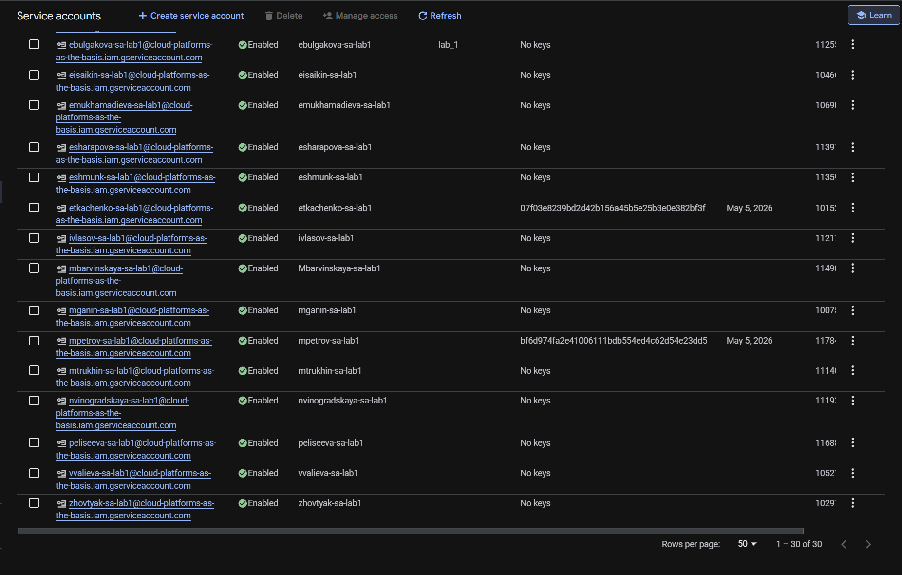
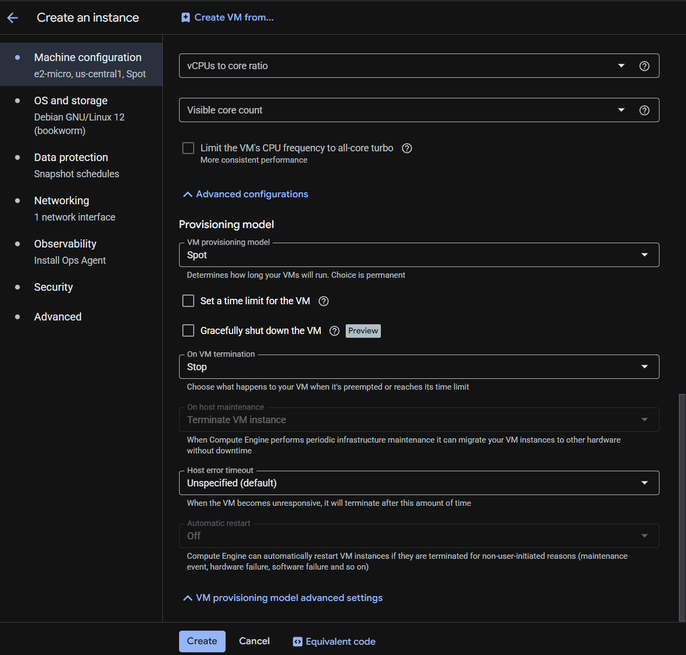
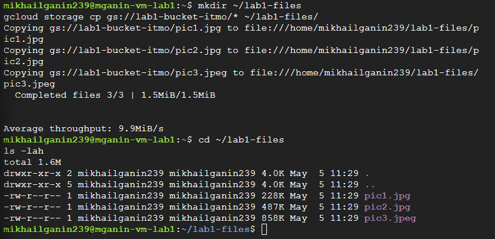
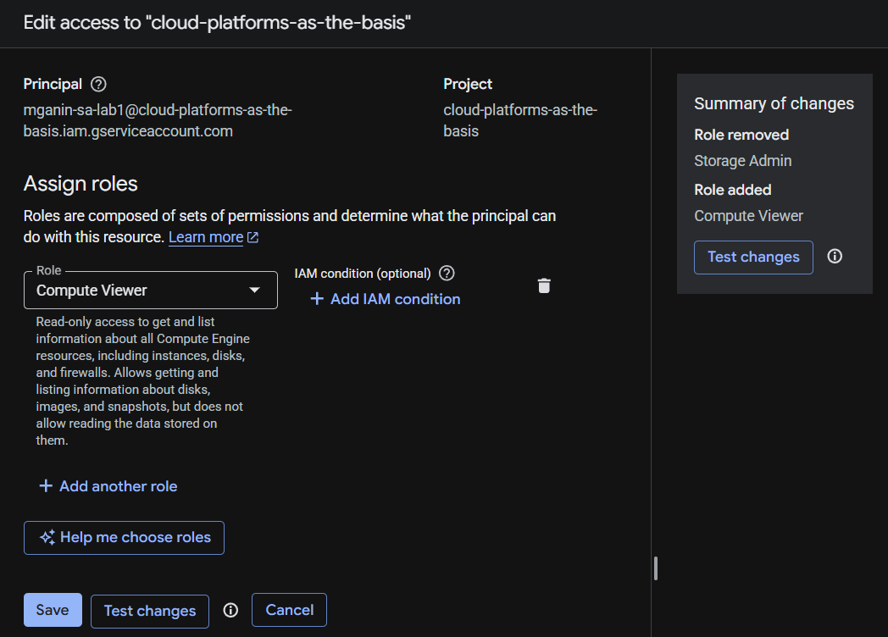
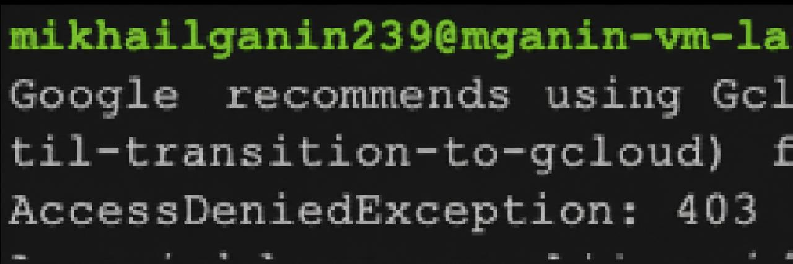

# Лабораторная работа №1
## Обзор Google Cloud и исследование основных сервисов

## Цель работы
Ознакомиться с основными возможностями и преимуществами облачной платформы Google Cloud, научиться создавать сервисные аккаунты, управлять ролями IAM, создавать виртуальные машины в режиме Spot, работать с Cloud Storage через утилиту gsutil.

## Ход работы

### 1. Получение доступа к Google Cloud
Заполнена Google-форма с указанием Gmail почты. Получен доступ к проекту в GCP.

### 2. Создание Service Account
В разделе IAM & Admin → Service Accounts создан сервисный аккаунт:

| Параметр | Значение |
|----------|----------|
| Имя | mganin-sa-lab1 |
| Роль | Storage Admin |

### 3. Создание виртуальной машины
В разделе Compute Engine → VM instances создана VM:

| Параметр | Значение |
|----------|----------|
| Имя | mganin-vm-lab1 |
| Тип машины | e2-micro |
| Режим | Spot VM |
| ОС | Debian 11 |

### 4. Подключение к VM
Через веб-интерфейс GCP нажата кнопка SSH. Подключение успешно.

### 5. Копирование файлов из бакета
Выполнены команды:

Просмотр содержимого бакета
gsutil ls gs://lab1-bucket-itmo/

Копирование файлов
gsutil cp gs://lab1-bucket-itmo/* .

### 6. Просмотр файлов на VM
ls -lah
Результат: три файла (pic1.jpg, pic1.jpg, pic1.jpg) успешно скопированы.

### 7. Изменение роли сервисного аккаунта
В разделе IAM роль изменена:

Было: Storage Admin

Стало: Compute Viewer

### 8. Проверка доступа после смены роли
Повторная попытка копирования:

gcloud cp gs://lab1-bucket-itmo/* .
Результат: ошибка AccessDeniedException (403)

# Вывод

Роль Storage Admin даёт доступ к бакету, а роль Compute Viewer — нет.
Система IAM Google Cloud работает по принципу наименьших привилегий.