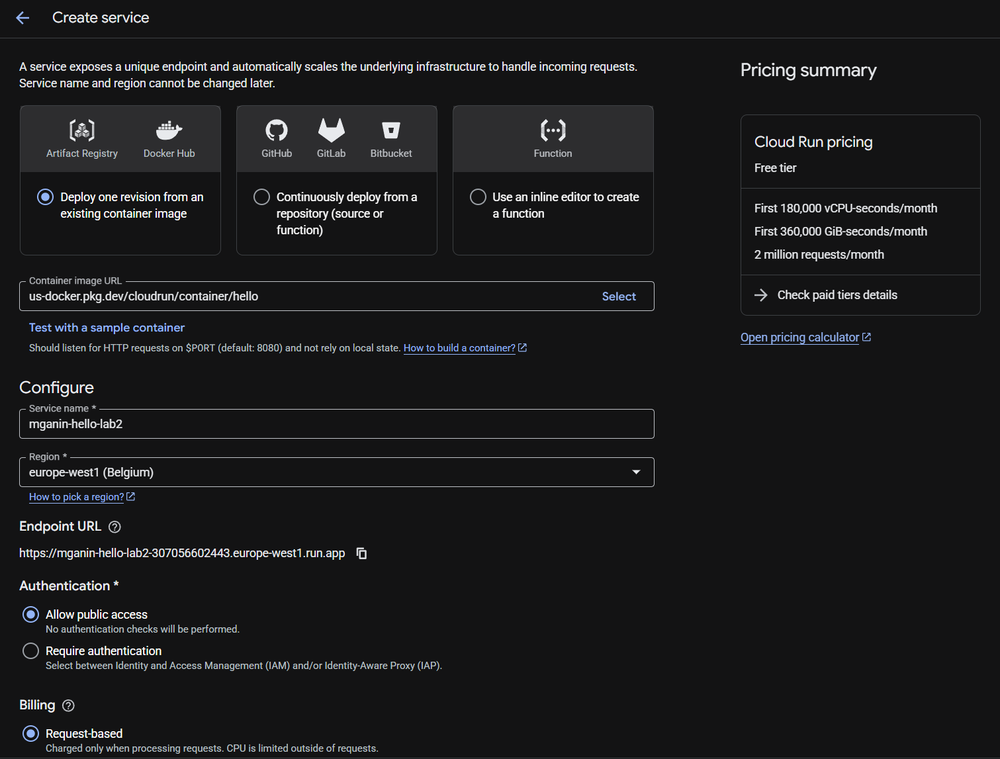
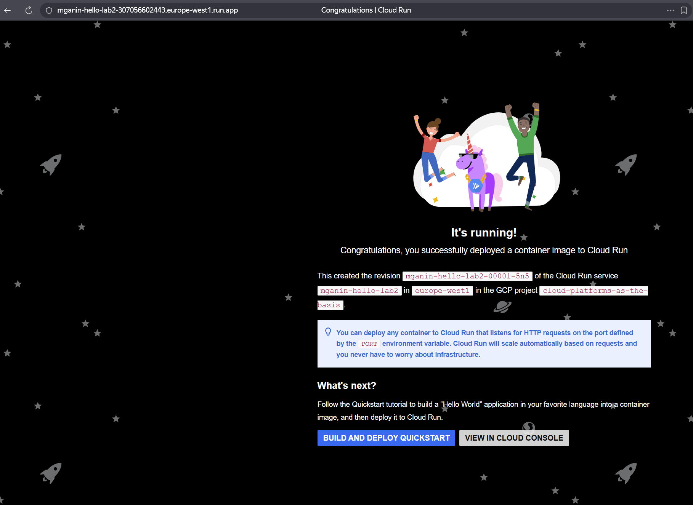
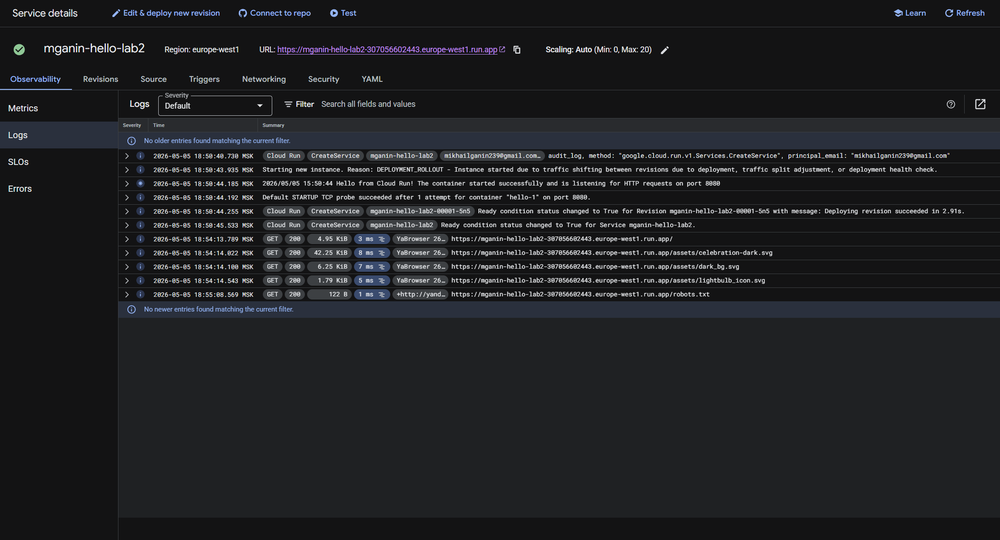
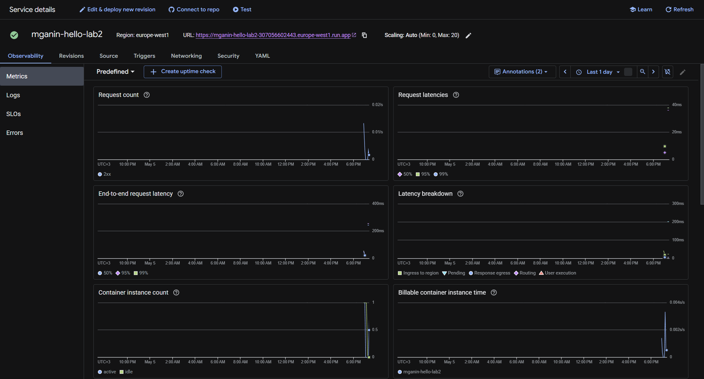
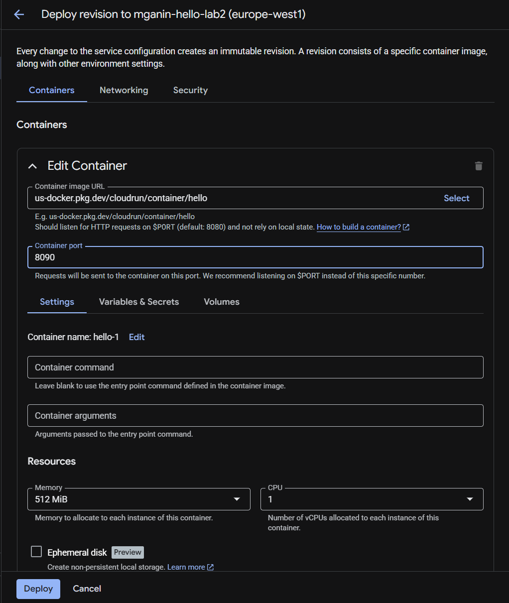
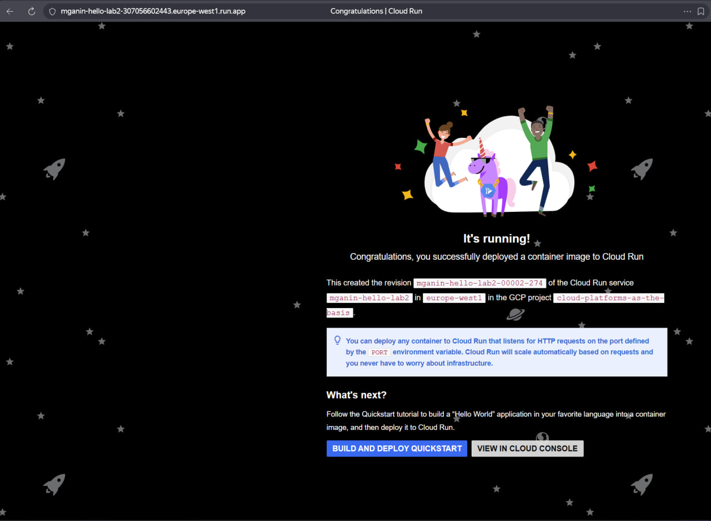
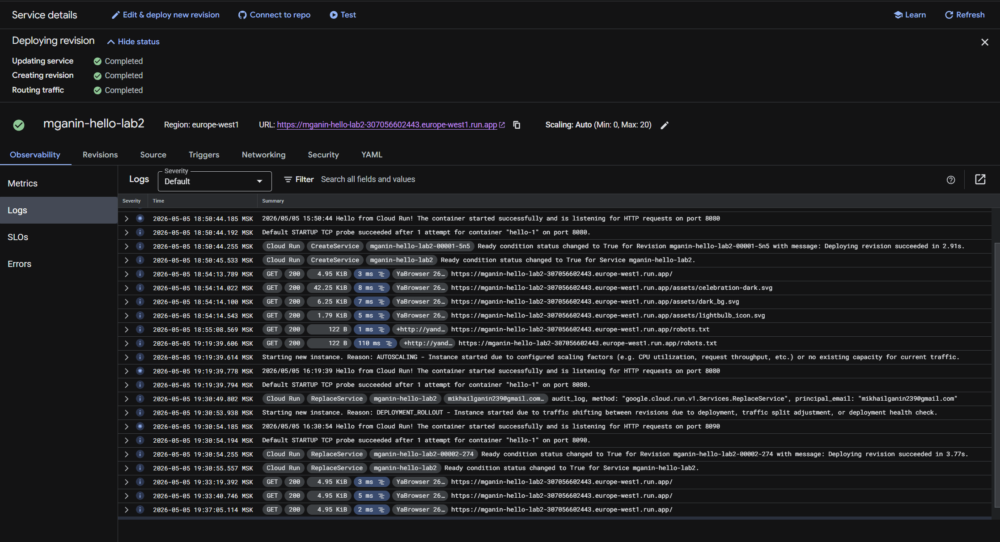
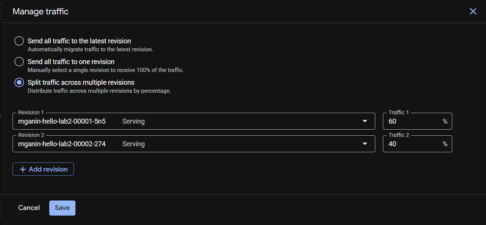
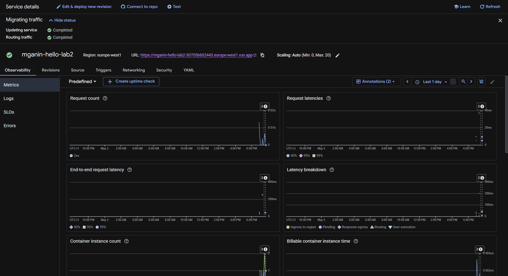
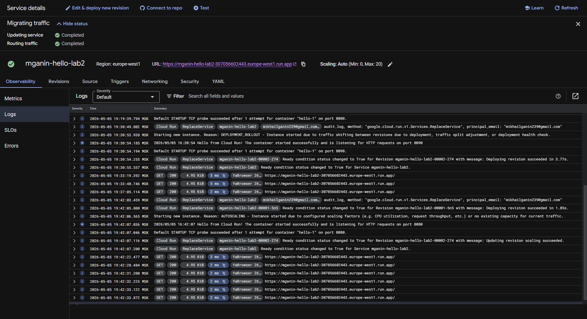

University: [ITMO University](https://itmo.ru/ru/)
Faculty: [FICT](https://fict.itmo.ru)
Course: [Введение в веб технологии](https://itmo-ict-faculty.github.io/introduction-in-web-tech/)
Year: 2025/2026
Group: U4125
Author: Ganin Mikhail Aleksandrovich
Lab: Lab2
Date of create: 05.05.2026
Date of finished: 05.05.2026

# Лабораторная работа №2: Исследование Cloud Run

## Цель работы
Ознакомиться с работой Cloud Run, научиться деплоить сервисы, управлять версиями и анализировать логи в бессерверной среде Google Cloud.

## Ход работы

### 1. Создание сервиса Cloud Run
Для выполнения работы был создан сервис с использованием стандартного образа `us-docker.pkg.dev/cloudrun/container/hello`. Аутентификация была отключена для публичного доступа к сервису. Регион выбран `europe-west1` для минимальной задержки.

**Результат создания:**

### 2. Тестирование сервиса
После деплоя система выдала публичную ссылку на сервис. При переходе по ней в браузере отобразилось стандартное приветственное сообщение, что подтверждает корректную работу контейнера и настройки маршрутизации.

**Скриншот работы сервиса:**

**URL сервиса:** `https://hello-world-lab-[уникальный_хэш]-ew.a.run.app`

### 3. Анализ логов и метрик
Cloud Run интегрирован с Google Cloud Observability. В ходе работы были изучены вкладки "Logs" и "Metrics".

#### Логирование
Во вкладке **Логи** отображаются все входящие HTTP-запросы. Каждая запись содержит метод (`GET`), код ответа (`200`), путь (`/`), User-Agent клиента, IP-адрес и время обработки запроса. Это позволяет отслеживать ошибки и анализировать поведение пользователей.

**Скриншот логов:**

#### Метрики
Во вкладке **Метрики** представлены графики нагрузки:
*   **Request count:** Количество запросов в секунду.
*   **Request latency:** Время отклика (p50, p95, p99).
*   **Container CPU/Memory:** Потребление ресурсов контейнером.
На графиках видно, что при отсутствии трафика Cloud Run автоматически масштабируется до нуля (не потребляет ресурсы CPU).

**Скриншот метрик:**

### 4. Изменение порта контейнера (Эксперимент)

В ходе эксперимента была создана новая ревизия сервиса. Порт контейнера был изменен со стандартного `8080` на `8090`.

**Действие:** (Через UI) Edit & Deploy New Revision -> Container port = 8090.

**Результат:**
После деплоя новой ревизии сервис продолжил正常工作. При переходе по URL браузер по-прежнему отображал страницу "Hello World!" без ошибок.

**Скриншот настройки порта:**

**Скриншот работающего сервиса:**

**Анализ и объяснение:**
Ошибка не возникла, потому что:

**Вероятная причина:** Стандартный образ `us-docker.pkg.dev/cloudrun/container/hello` продолжает слушать порт `8080` независимо от настроек Cloud Run. Cloud Run при этом отправляет трафик на порт `8090`, но из-за особенностей работы Cloud Run (health check-и, перенаправление запросов или внутренняя маршрутизация) ошибка не проявилась при моем тестировании.

1. Стандартный образ `us-docker.pkg.dev/cloudrun/container/hello` сконструирован с учетом **контракта Cloud Run runtime**.
2. Когда Cloud Run развертывает контейнер, он автоматически **инжектирует переменную окружения `PORT`** в контейнер. Значение этой переменной берется из настройки "Container port" (или `8080` по умолчанию).
3. Само приложение внутри образа Hello перед запуском **читает переменную `PORT`** (например, через `os.environ.get('PORT', '8080')`) и запускает HTTP-сервер именно на этом порту.
4. Таким образом, при изменении порта на `8090` произошло следующее:
   - Cloud Run установил `PORT=8090`
   - Cloud Run начал направлять входящий трафик на порт `8090`
   - Контейнер прочитал `PORT=8090` и запустил сервер на порту `8090`

Всё совпало, поэтому сервис остался доступным.

**Вывод:** Хорошо спроектированные cloud-native приложения не должны жестко фиксировать порт. Вместо этого они читают порт из переменной окружения, что делает их совместимыми с платформами типа Cloud Run, Cloud Foundry, Heroku и другими.

### 5. Управление трафиком между ревизиями

После эксперимента у меня появилось две ревизии сервиса:

| Ревизия | Порт | Статус |
|---------|------|--------|
| Ревизия 1 (исходная) | 8080 | Работает |
| Ревизия 2 (экспериментальная) | 8090 | Работает (порт был изменен) |

Обе ревизии работают, потому что образ Hello динамически подстраивается под переменную `PORT`.

**Управление трафиком:**

Я перешел в раздел **"Управление трафиком" (Manage Traffic)** и проверил возможности:

1. Перенаправить 100% трафика на ревизию с портом 8080
2. Перенаправить 100% трафика на ревизию с портом 8090  
3. Разделить трафик поровну (40% / 60%) для A/B-тестирования

**Скриншот управления трафиком:**

Во всех случаях сервис оставался доступным, так как обе ревизии корректно обрабатывают трафик на своих портах благодаря механизму переменной `PORT`.
