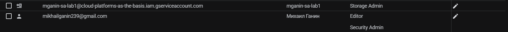
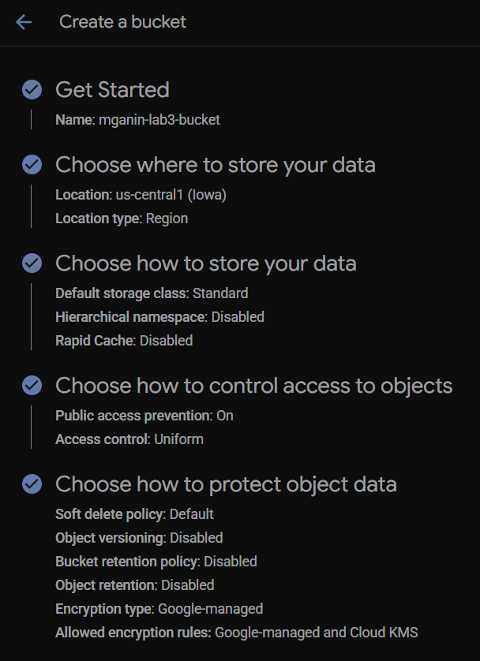
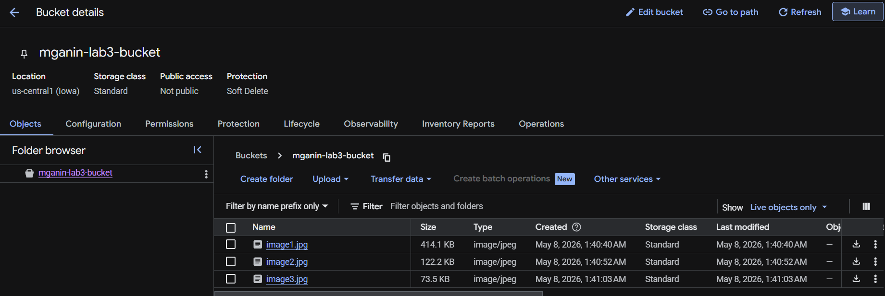
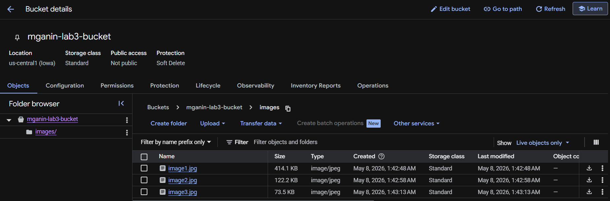
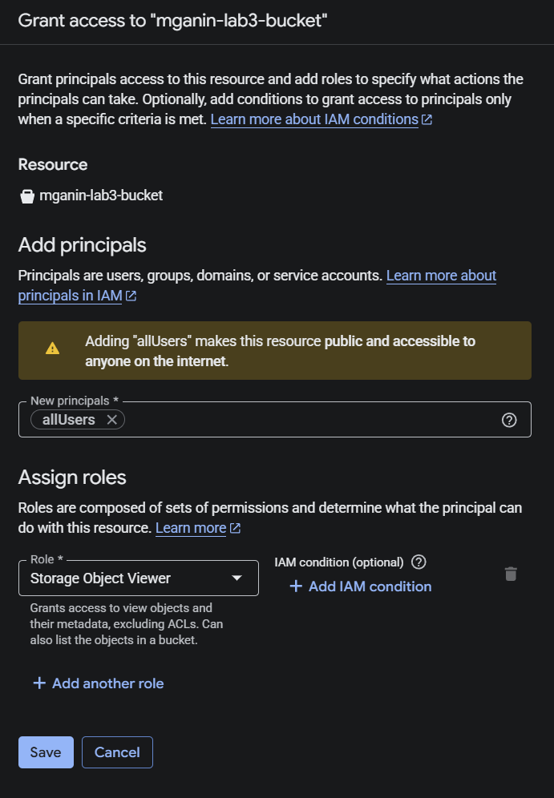
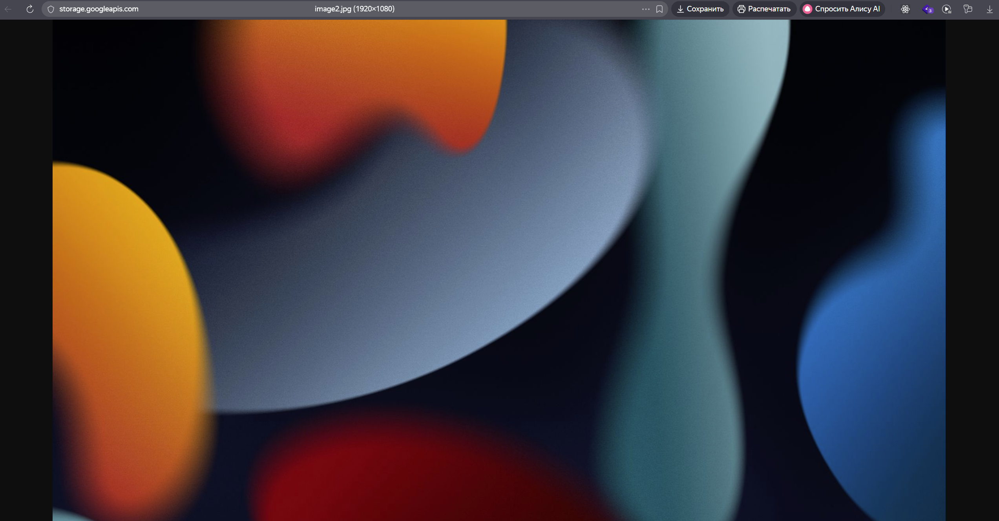

# Лабораторная работа №3
## Исследование Cloud Storage

## Цель работы
Ознакомиться с основными понятиями и принципами работы облачного хранилища, изучить различные модели хранения данных (блок, файл, объектное хранилище), познакомиться с основными сервисами и функционалом, предоставляемым облачными хранилищами на примере Google Cloud Storage.

## Теоретическая часть

### Модели хранения данных

| Тип хранилища | Описание | Примеры |
|--------------|----------|---------|
| Блочное хранилище | Данные разбиваются на блоки, каждый блок имеет свой адрес. Высокая производительность, используется для баз данных и виртуальных машин | Google Persistent Disk, AWS EBS |
| Файловое хранилище | Иерархическая структура (папки и файлы). Доступ через протоколы NFS/SMB | Google Filestore, AWS EFS |
| Объектное хранилище | Данные хранятся как объекты с метаданными. Неограниченное масштабирование, доступ через HTTP API | Google Cloud Storage, AWS S3 |

### Google Cloud Storage
Cloud Storage — это объектное хранилище в GCP. Ключевые особенности:
- **Бакеты (Buckets)** — контейнеры для хранения объектов
- **Объекты** — файлы с метаданными
- **Классы хранения** — Standard, Nearline, Coldline, Archive
- **Управление доступом** — IAM роли и ACL

## Ход работы

### 1. Выбор проекта
Для выполнения работы был выбран существующий проект GCP, в котором имеются права на создание и управление бакетами (роль Storage Admin).

*Скриншот 1 — Выбранный проект в консоли GCP:*

### 2. Создание Cloud Storage бакета
В разделе **Cloud Storage → Buckets** был создан новый бакет со следующими параметрами:

| Параметр | Значение |
|----------|----------|
| Имя бакета | `mganin-lab3-bucket` |
| Location type | Region |
| Location | `us-central1 (Iowa)` |
| Storage class | Standard |
| Access control | Uniform |

*Скриншот 2 — Создание бакета:*

После создания бакет появился в списке

### 3. Загрузка изображений в бакет
В созданный бакет было загружено 4 изображения в форматах JPG.

**Способ загрузки** — через веб-интерфейс GCP:
1. Открыт бакет `mganin-lab3-bucket`
2. Нажата кнопка **Upload Files**
3. Выбраны 3 файла с локального компьютера

*Скриншот 3 — Загруженные файлы в бакете:*

**Список загруженных файлов:**
- `image1.jpg`
- `image2.jpg`
- `image3.jpg`

### 4. Создание папки и перемещение файлов
Внутри бакета была создана папка с именем `images`.

**Действия:**
1. Нажата кнопка **Create folder**
2. Введено имя папки: `images`
3. Выбраны все загруженные изображения
4. Нажата кнопка **Move** и выбрана папка `images/`

*Скриншот 4 — Папка `images` с перемещенными файлами:*

**Важно:** В объектном хранилище папки являются логической абстракцией (префиксами в имени объекта). Физически все объекты хранятся на одном уровне, но консоль GCP отображает их как иерархию.

### 5. Настройка публичного доступа
Для обеспечения публичного доступа к файлам была настроена политика доступа на уровне бакета.

**Действия:**
1. Переход на вкладку **Permissions**
2. Нажатие **+ Grant Access**
3. В поле **New principals** введено `allUsers`
4. Выбрана роль **Cloud Storage Object Viewer**
5. Нажата кнопка **Save**
6. Подтверждено понимание последствий публичного доступа

*Скриншот 5 — Добавление публичного доступа для allUsers:*

После этого все объекты в бакете стали доступны для чтения любому пользователю в интернете.

### 6. Создание ссылок на файлы
Для каждого файла была получена публичная ссылка через контекстное меню:

**Действия:**
1. Внутри папки `my-images` нажаты три точки (⋮) рядом с файлом
2. Выбран пункт **Copy Cloud Storage URL**

*Скриншот 7 — Контекстное меню с копированием ссылки:*

**Формат полученной ссылки:**

https://storage.googleapis.com/mganin-lab3-bucket/images/image2.jpg