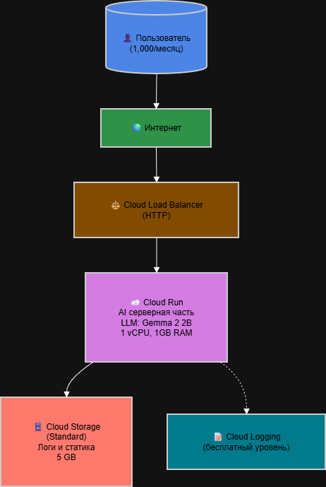
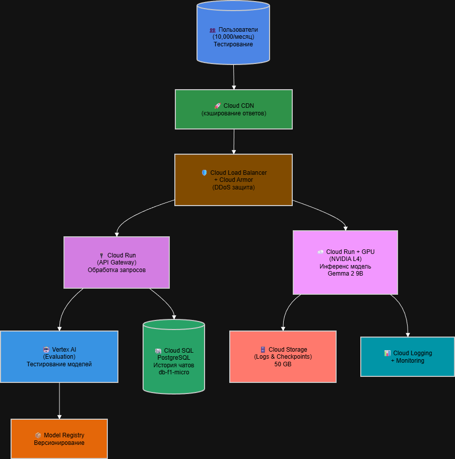
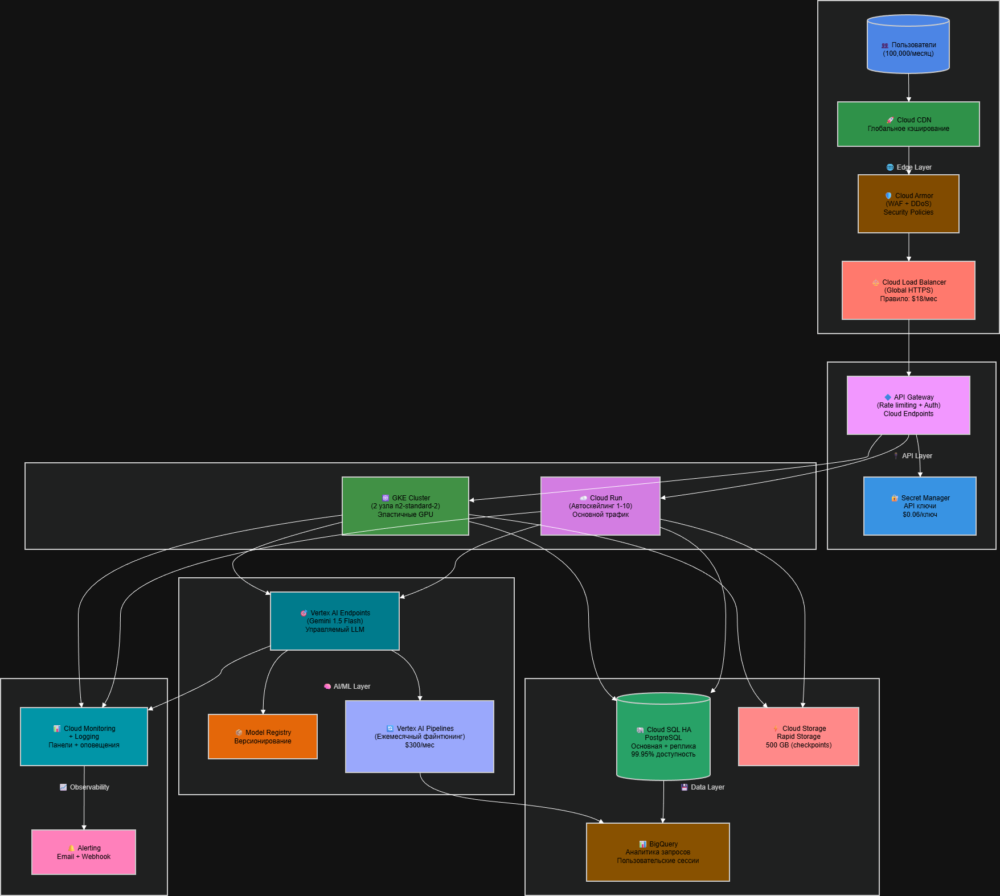

# Лабораторная работа №4
## Разработка инфраструктуры MVP AI приложения

---

## Цель работы

Создать прототип AI-приложения с базовой функциональностью, разработать схему инфраструктуры для трёх состояний (MVP, тестирование партнёрами, продакшн), рассчитать экономическую модель и обосновать выбор сервисов Google Cloud Platform для каждого этапа развития продукта.

---

## Сценарий приложения

**Продукт:** Чат-бот для автоматической поддержки клиентов интернет-магазина

**Функциональность:**
- Ответы на типовые вопросы (статус заказа, условия возврата, характеристики товаров)
- Эскалация сложных вопросов оператору
- Сбор обратной связи от пользователей
- Аналитика популярных запросов

**Технические требования:**
- Низкая задержка ответа (< 2 секунд)
- Поддержка до 100 000 пользователей в продакшне
- Конфиденциальность данных клиентов
- Возможность дообучения модели на истории чатов

**Нагрузка по этапам:**

| Параметр | MVP | Тестирование | Продакшн |
|----------|-----|--------------|----------|
| Пользователей / месяц | 1 000 | 10 000 | 100 000 |
| Запросов к боту / месяц | 10 000 | 50 000 | 500 000 |
| Средний размер запроса (токенов) | 200 | 400 | 1 000 |
| Средний размер ответа (токенов) | 100 | 200 | 500 |
| Сохранение истории чатов | Нет | Да | Да, с аналитикой |
| Требования к доступности | 99.5% | 99.9% | 99.95% |

---

## Схемы инфраструктуры

### Состояние 1: Начальное (MVP)

**Состав:**
- Cloud Load Balancer (HTTP)
- Cloud Run (1 vCPU, 1GB RAM) с моделью Gemma 2 2B
- Cloud Storage (Standard, 5 GB для логов)

### Состояние 2: Тестирование партнёрами

**Состав:**
- Cloud CDN + Cloud Load Balancer + Cloud Armor
- Cloud Run с GPU (NVIDIA L4) для модели Gemma 2 9B
- Cloud Run (API Gateway) для маршрутизации
- Cloud SQL PostgreSQL (db-f1-micro)
- Vertex AI Evaluation
- Cloud Storage (50 GB для логов и чекпоинтов)

### Состояние 3: Продакшн-решение

**Состав:**
- Edge Layer: Cloud CDN + Cloud Armor + Global HTTPS Load Balancer
- API Layer: API Gateway + Secret Manager
- Compute Layer: GKE (2 узла n2-standard-2) + Cloud Run (автоскейлинг 1-10)
- AI/ML Layer: Vertex AI Endpoints (Gemini 1.5 Flash) + Vertex AI Pipelines
- Data Layer: Cloud SQL HA + BigQuery + Cloud Storage Rapid Storage
- Observability: Cloud Monitoring + Logging + Alerting

---

## Обоснование выбора сервисов

### Cloud Run

**Почему выбран:**
- Serverless платформа, автоскейлинг от 0 до N
- Оплата за фактическое использование (экономия на MVP)
- Поддержка GPU для инференса LLM
- Быстрый деплой из контейнера

**Почему не альтернативы:**
- App Engine — меньше гибкости с GPU
- GKE — избыточен для MVP, сложнее в управлении
- Compute Engine — требует ручного масштабирования

### Vertex AI

**Почему выбран:**
- Управляемый ML платформа с авто-масштабированием GPU/TPU
- Model Registry для версионирования моделей
- Vertex AI Endpoints с низкой задержкой
- Pipeline как сервис для повторяемого файнтюнинга

### Cloud SQL HA

**Почему выбран:**
- Управляемый PostgreSQL с бэкапами и патчами
- High Availability (реплика) с RTO < 60 секунд
- PITR (Point-in-Time Recovery) для восстановления на любую минуту
- ACID гарантии для данных пользователей

### Cloud Storage с Rapid Storage

**Почему выбран:**
- Rapid Storage tier для минимальной задержки чекпоинтов моделей
- Бесконечное масштабирование для логов и медиа
- Object Lifecycle Management для автоматического удаления старых логов

### BigQuery

**Почему выбран:**
- Serverless аналитика без управления кластерами
- Встроенная ML для кластеризации пользователей
- Streaming insert для потоковой загрузки логов чатов
- Бесплатный уровень до 1 TB запросов

---

## Экономическая модель (расчёт затрат)

### 1. Cloud Run (CPU + memory)

**Формула:** vCPU-сек × $0.000024 + GB-сек × $0.0000025

| Состояние | vCPU-сек/мес | Стоимость | GB-сек | Стоимость | **Итого** |
|-----------|--------------|-----------|--------|-----------|-----------|
| MVP | 50 000 | $1.20 | 50 000 | $0.13 | **$1.33** |
| Тестирование | 100 000 | $2.40 | 100 000 | $0.25 | **$2.65** |
| Продакшн | 200 000 | $4.80 | 200 000 | $0.50 | **$5.30** |

---

### 2. Cloud Run GPU (NVIDIA L4)

**Формула:** GPU-часы × $1.44

| Состояние | Часов GPU/мес | Расчёт | **Итого** |
|-----------|---------------|--------|-----------|
| MVP | 0 | — | **$0** |
| Тестирование | 200 | 200 × $1.44 | **$288** |
| Продакшн | 0 | вынесено на Vertex AI | **$0** |

---

### 3. GKE Cluster

**Формула:** 2 узла × стоимость n2-standard-2 ($0.0965/час) × 730 часов

| Состояние | **Итого** |
|-----------|-----------|
| MVP | **$0** |
| Тестирование | **$0** |
| Продакшн | 2 × 0.0965 × 730 = **$141** |

---

### 4. Vertex AI Inference (Gemini 1.5 Flash)

**Формула:** Входные токены × $0.0375/1M + Выходные токены × $0.15/1M

| Состояние | Входные токены (млн) | Выходные токены (млн) | Расчёт | **Итого** |
|-----------|---------------------|----------------------|--------|-----------|
| MVP | 0 | 0 | — | **$0** |
| Тестирование | 20 | 10 | 20×0.0375 + 10×0.15 | **$2.25** |
| Продакшн | 500 | 250 | 500×0.0375 + 250×0.15 | **$56.25** |

---

### 5. Vertex AI Training (файнтюнинг)

| Состояние | **Итого** |
|-----------|-----------|
| MVP | **$0** |
| Тестирование | **$0** |
| Продакшн | 1 запуск × $300 = **$300** |

---

### 6. Cloud SQL

| Состояние | Конфигурация | **Итого** |
|-----------|--------------|-----------|
| MVP | не используется | **$0** |
| Тестирование | db-f1-micro, 10GB | **$12** |
| Продакшн | HA: 4 vCPU, 16GB + реплика | **$280** |

---

### 7. Cloud Storage

**Формула:** GB-месяцев × $0.02

| Состояние | Объём (GB) | Тип | **Итого** |
|-----------|------------|-----|-----------|
| MVP | 5 | Standard | **$0.10** |
| Тестирование | 50 | Standard | **$1.00** |
| Продакшн | 500 | Rapid Storage | **$10.00** |

---

### 8. BigQuery

| Состояние | Объём запросов | Бесплатный уровень | Расчёт | **Итого** |
|-----------|----------------|---------------------|--------|-----------|
| MVP | 0 | — | — | **$0** |
| Тестирование | 0 | — | — | **$0** |
| Продакшн | 200 TB | 1 TB | 199 × $5 | **$995** |

> ⚠️ BigQuery можно оптимизировать до $50-100/мес при использовании partitioning и clustering

---

### 9. Сеть (Load Balancing + CDN + Armor)

| Компонент | Цена | MVP | Тестирование | Продакшн |
|-----------|------|-----|--------------|----------|
| Forwarding rule | $18/мес | $18 | $18 | $18 |
| Cloud CDN | $0.02/GB | $0 | $10 | $50 |
| Cloud Armor | $6/политика | $0 | $6.20 | $8 |
| **Итого** | | **$18** | **$34.20** | **$76** |

---

### 10. Исходящий трафик (Data Transfer Out)

**Формула:** GB × $0.12 (первые 1 TB в месяц бесплатно)

| Состояние | Трафик (GB) | Бесплатно | Платно | **Итого** |
|-----------|-------------|-----------|--------|-----------|
| MVP | 5 | 5 | 0 | **$0.60** |
| Тестирование | 50 | 50 | 0 | **$6.00** |
| Продакшн | 500 | 200 | 300 × $0.12 | **$36.00** |

---

### 11. Secret Manager

**Формула:** $0.06 за активный ключ в месяц

| Состояние | Ключей | **Итого** |
|-----------|--------|-----------|
| MVP | 0 | **$0** |
| Тестирование | 0 | **$0** |
| Продакшн | 5 | **$0.30** |

---

### 12. Cloud Monitoring + Logging

| Состояние | **Итого** |
|-----------|-----------|
| MVP | $0 (бесплатный уровень) |
| Тестирование | $0 (бесплатный уровень) |
| Продакшн | **$50** |

---

## Сводная таблица затрат

| Статья расходов | MVP ($) | Тестирование ($) | Продакшн ($) |
|----------------|---------|------------------|---------------|
| **Compute Layer** | | | |
| Cloud Run (CPU) | 1.33 | 2.65 | 5.30 |
| Cloud Run GPU | 0 | 288 | 0 |
| GKE Cluster | 0 | 0 | 141 |
| **AI/ML Layer** | | | |
| Vertex AI Inference | 0 | 2.25 | 56.25 |
| Vertex AI Training | 0 | 0 | 300 |
| **Storage & Database** | | | |
| Cloud SQL | 0 | 12 | 280 |
| Cloud Storage | 0.10 | 1 | 10 |
| BigQuery | 0 | 0 | 995 |
| **Network** | | | |
| Load Balancing + CDN + Armor | 18 | 34.20 | 76 |
| Data Transfer Out | 0.60 | 6 | 36 |
| **Security & Ops** | | | |
| Secret Manager | 0 | 0 | 0.30 |
| Cloud Monitoring + Logging | 0 | 0 | 50 |
| **ИТОГО** | **$20.03** | **$346.10** | **$1,949.85** |

---

## Анализ и выводы по экономической модели

### Ключевые наблюдения:

1. **MVP дешевле $25/месяц** → можно запустить с личного бюджета или за счёт гранта GCP ($300 бесплатно на первый год)

2. **Тестирование с партнёрами (~$350/месяц)** → требует бюджета от бизнеса, но всё ещё доступно для стартапа

3. **Продакшн ($1,950/месяц)** → только при подтверждённом product-market fit

### Основные драйверы затрат в продакшне:

| Драйвер | Стоимость | Доля |
|---------|-----------|------|
| BigQuery | $995 | 51% |
| Vertex AI Training | $300 | 15% |
| Cloud SQL HA | $280 | 14% |
| GKE | $141 | 7% |
| Остальное | ~$234 | 13% |

### Рекомендации по оптимизации:

| Сервис | Проблема | Решение | Экономия |
|--------|----------|---------|----------|
| BigQuery | $995/мес | Partitioning + Clustering, ограничение запросов | до $900 |
| Cloud SQL | $280/мес | Рассмотреть AlloyDB для аналитики | до $100 |
| GKE | $141/мес | Spot VM для некритичных задач | до $85 |
| Cloud Run GPU | $288 (на тестировании) | Использовать предзагруженную модель на CPU при возможности | до $200 |

**Потенциальная оптимизированная стоимость продакшна:**
$1,950 - $900 (BigQuery) - $100 (Cloud SQL) - $85 (GKE) = **~$865/месяц**

### Рост затрат по этапам:

| Этап | Стоимость | Рост относительно предыдущего |
|------|-----------|-------------------------------|
| MVP | $20 | — |
| Тестирование | $346 | **×17** (добавлен GPU + база) |
| Продакшн | $1,950 | **×5.6** (добавлены HA, аналитика, ML пайплайн) |

---

## Выводы

В ходе выполнения лабораторной работы «Разработка инфраструктуры MVP AI приложения» был спроектирован прототип AI-чат-бота для поддержки клиентов интернет-магазина. Инфраструктура разработана для трёх последовательных состояний зрелости продукта: начальное (MVP), тестирование партнёрами и продакшн-решение.

### Основные результаты работы

1. **Разработаны схемы инфраструктуры** для каждого этапа с использованием сервисов Google Cloud Platform, учитывающие требования к нагрузке, доступности и безопасности.

2. **Обоснован выбор каждого сервиса** с точки зрения технических требований, стоимости и масштабируемости.

3. **Проведён детальный экономический расчёт** на основе официальных тарифов GCP на 2026 год.